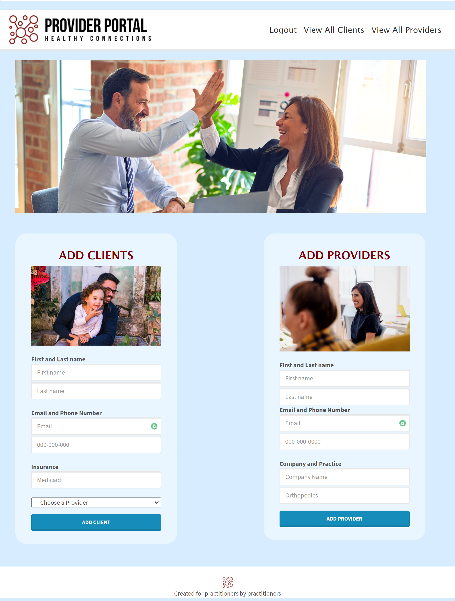

# Project 2: Provider Portal

## Table of Contents

- [Project Description](#description)
- [Installation Process](#installation)
- [Team Information](#team)

## Application Description:

---

> This application helps a start-up healthcare company with their need for a customer relationship management (CRM) application where they can view and add both clients and providers

Below is a picture of the Application:

## Installation:

> _To install, please run "npm i" in your terminal to download the proper inquirer and mysql dependancies._

---

## Team Information:

- **Name:** Seth Hulsmeyer
- **GitHub Username:** Seth-hulsmeyer
- **Email:** seth.hulsmeyer@hotmail.com

- **Name:** Samantha Rae
- **GitHub Username:** speloqu24
- **Email:** speloqu24@gmail.com

- **Name:** Sara King
- **GitHub Username:** sarahayes20
- **Email:** saran.hayes85@gmail.com
